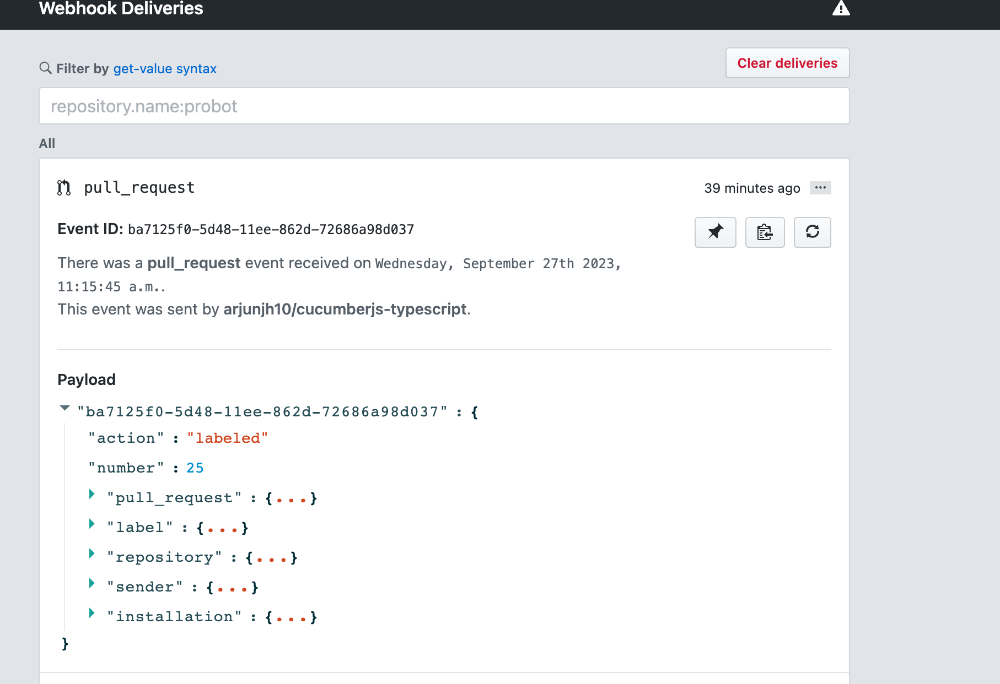
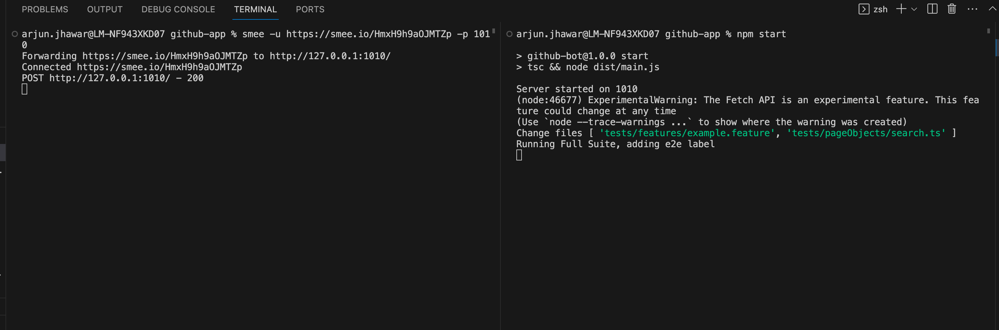
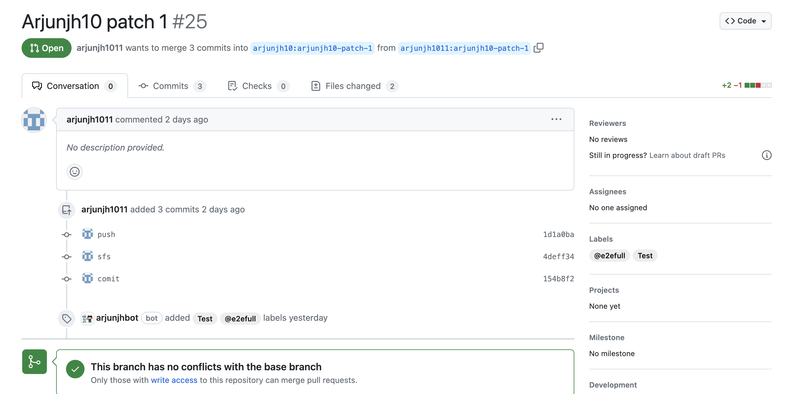

# Purpose
To be able to create a github application that can be used to communicate back to github based on 
actions required.

# Summary
This project uses the concepts of Github Apps to implement a simple Express JS server that can 
receive webhooks from github.com for a respository and make REST API calls on the pull requests like, 
adding labels, issuing comments on the PR or even approving pull requests.

The application uses SMEE channel to send webhooks to the local dev server for the purpose of development.

# Running Project
1) Refer to the `.env.example` file to setup the required env variables for the project.
2) Create a SMEE channel and paste the SMEE link in your env file.
4) In a separate terminal, `npm start` - should start your server on port 1010 and eventually get your smee client to port forward 
incoming webhooks to it.
5) Open a pull request, or push to a pull request on your repository, see the magic happen.

# Demo
For the purpose of simplicity, the project subscribes to the `pull_request` webhook, and if the pull request event 
received contains files under `test/features` folder, it adds a new label to the pull request `@e2efull`. The label 
can later be used to trigger specific tests if needed. 

E.g. 
1) Incoming webhook:

2) Console:

2) pull request with added label:

# Helpful Info

The project build in this repository was with intention to learn to build a github app from scratch. 
For those who prefer a faster approach, they can easily leverage using Probot framework that will offer app creation
out of the box. https://probot.github.io/

